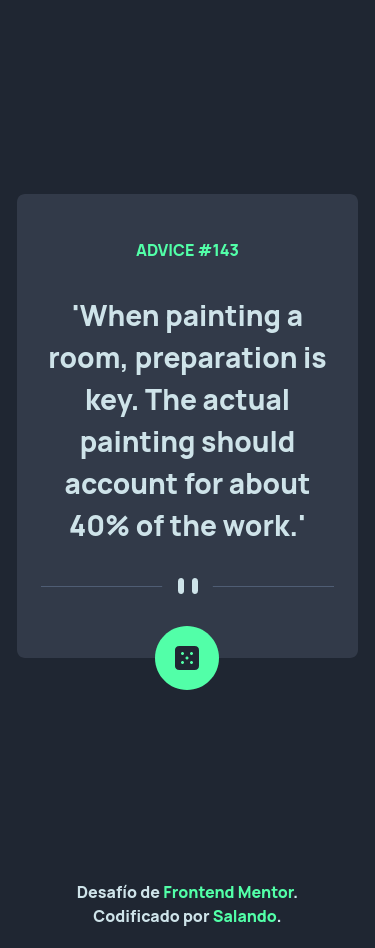

# Solución de Frontend Mentor - Advice Generator App

Esta es mi solución al desafío de Frontend Mento, ["Advice Generator App"](https://www.frontendmentor.io/challenges/advice-generator-app-QdUG-13db).

## Tabla de Contenidos

- [Solución de Frontend Mentor - Advice Generator App](#solución-de-frontend-mentor---advice-generator-app)
  - [Tabla de Contenidos](#tabla-de-contenidos)
  - [Descripción General](#descripción-general)
    - [El Desafío](#el-desafío)
    - [Screenshots](#screenshots)
      - [Teléfono](#teléfono)
      - [Desktop](#desktop)
        - [Normal](#normal)
        - [Estados Activados](#estados-activados)
    - [Links](#links)
  - [Mi Proceso](#mi-proceso)
    - [Tecnologías](#tecnologías)
    - [¿Que aprendí?](#que-aprendí)
    - [Continuar desarrollando](#continuar-desarrollando)
    - [Recursos Útiles](#recursos-útiles)
  - [Autor](#autor)
  - [Agradecimientos](#agradecimientos)

## Descripción General

### El Desafío

Los requerimientos del desafío son:

- Ver el diseño óptimo para la aplicación según el tamaño de pantalla de su dispositivo
- Ver estados de desplazamiento para todos los elementos interactivos en la página
- Genera un nuevo consejo haciendo clic en el ícono del dado

### Screenshots

#### Teléfono

375px

#### Desktop

##### Normal

1440px

##### Estados Activados

### Links

<!-- TODO  falata poner el la url del sitio y el de la solución-->
- [Solución "Advice Generator App"](https://your-solution-url.com)
- 

## Mi Proceso

### Tecnologías

Esta página web esta construida con las siguientes tecnologías:

- Flexbox
- Mobile-first
- [Postcss](https://postcss.org/)
- [Tailwindcss](https://tailwindcss.com/)
- [Pnpm](https://pnpm.io/es/)

### ¿Que aprendí?

Aprendí sobre la función *async* de **Javascript** para el manejo de operaciones asíncronas, ya antes había probado la estructura *then* para operaciones asíncronas y la verdad todavía me sigue gustando más, pero esta manera de manejar operaciones asíncronas me gusta tambien, se ve más ordenado y limpio el código, siento que se ve de manera más lógica, aun así todavía me sigue resultando confuso.

### Continuar desarrollando

Quiero seguir haciendo más páginas con Tailwindcss y Postcss para seguir mejorando mis habilidades.

### Recursos Útiles

- [Guía Flexbox](https://css-tricks.com/snippets/css/a-guide-to-flexbox/) - Me ayudo a aprender Flexbox.
- [Juego para practicar Flexbox](https://flexboxfroggy.com/#es) - Me ayudo a practicar Flexbox.

## Autor

- [Frontend Mentor](https://www.frontendmentor.io/profile/SaulOrlando)
- [Github](https://github.com/SaulOrlando)

## Agradecimientos

Agradezco a mi profesora que me enseño bien.
